# Active Directory Home Lab — Windows Server 2022 + Windows 11 Enterprise

## Objective

Built a fully functional Active Directory domain environment from scratch to simulate enterprise identity management, endpoint configuration, and security policy enforcement. The goal was to replicate the core AD infrastructure found in real enterprise environments and demonstrate hands-on skills in Windows Server administration, Group Policy, and domain security hardening.

---

## Environment

| Component | Details |
|---|---|
| Host OS | Windows 11 (VMware Workstation Player 17) |
| Domain Controller OS | Windows Server 2022 Standard Evaluation (Desktop Experience) |
| Client OS | Windows 11 Enterprise Evaluation (Build 26100) |
| Domain Name | corp.local |
| DC Hostname | WIN-9FVVLHAVPRB |
| DC IP Address | 192.168.114.10 (static) |
| Client IP Address | 192.168.114.20 (static) |
| Virtualization | VMware Workstation Player — NAT networking |

---

## What I Built

### 1. Domain Controller (DC01)
- Deployed Windows Server 2022 in VMware with 4GB RAM, 2 vCPUs, 60GB disk
- Installed the Active Directory Domain Services (AD DS) and DNS Server roles
- Promoted the server to a Domain Controller for a new forest: **corp.local**
- Configured a static IP address and set DNS to loopback (127.0.0.1) for local resolution
- Set domain and forest functional level to Windows Server 2016 to reflect realistic enterprise environments

**Screenshot — Server Manager showing AD DS and DNS roles installed:**

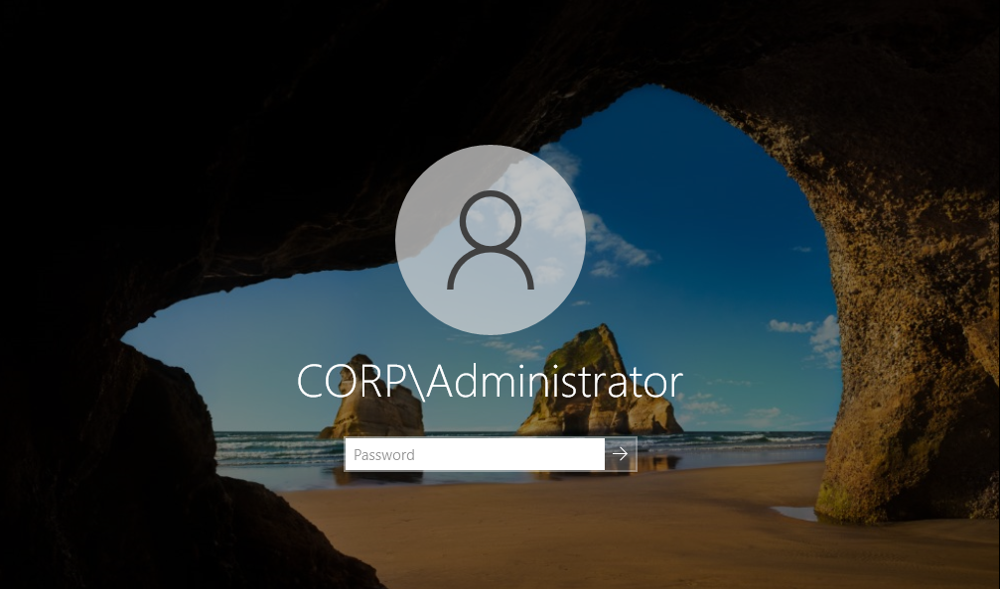

**Screenshot — CORP\Administrator login confirming domain exists:**

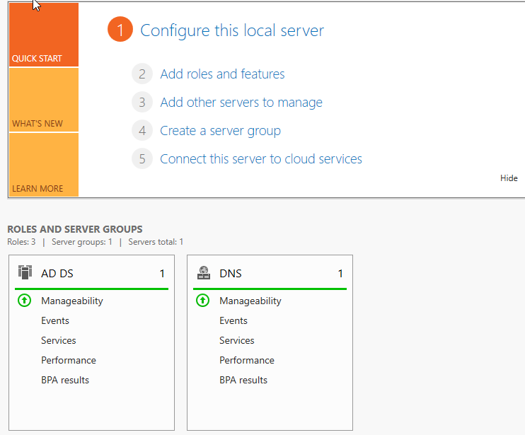

---

### 2. Organizational Units, Users, and Security Groups
- Opened Active Directory Users and Computers (ADUC)
- Created 4 Organizational Units mirroring a real company structure: **IT**, **HR**, **Finance**, **Workstations**
- Created 6 domain user accounts distributed across the OUs:
  - IT: john.smith, jane.doe
  - HR: bob.jones, sarah.lee
  - Finance: mike.chen, lisa.park
- Created a Security Group named **IT-Admins** in the IT OU
- Added john.smith and jane.doe as members of IT-Admins to simulate privileged access management

**Screenshot — OU structure with users visible in ADUC:**

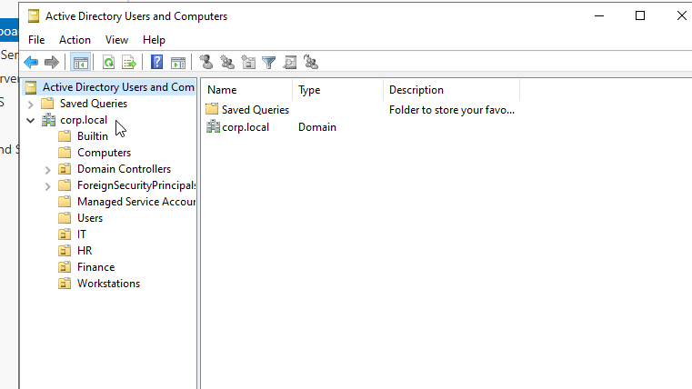

**Screenshot — IT-Admins group membership:**

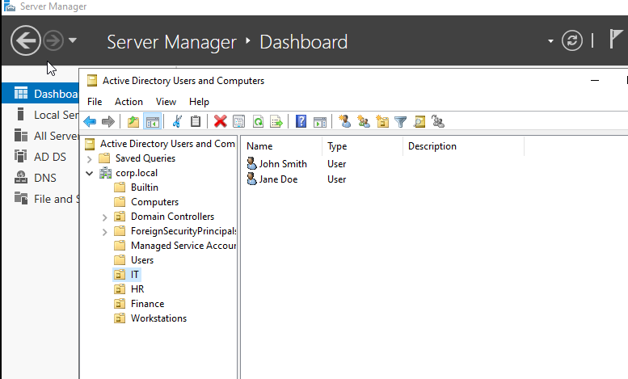

---

### 3. Windows 11 Enterprise Client (CLIENT01)
- Deployed Windows 11 Enterprise in VMware with 4GB RAM, 2 vCPUs, 40GB disk
- Configured a static IP (192.168.114.20) and pointed DNS at DC01 (192.168.114.10)
- Successfully joined the machine to the **corp.local** domain
- Verified domain join by logging in as CORP\john.smith and confirming the "Sign in to: CORP" prompt on the login screen
- Confirmed CLIENT01 appeared in the Computers container in ADUC on DC01

**Screenshot — Windows 11 Enterprise desktop after installation:**

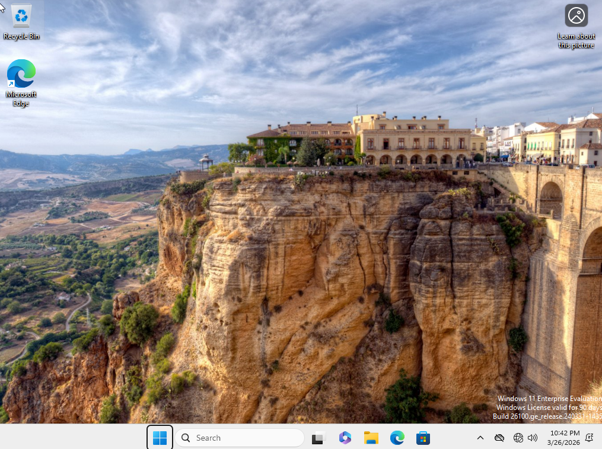

**Screenshot — Windows 11 login screen showing Sign in to: CORP:**

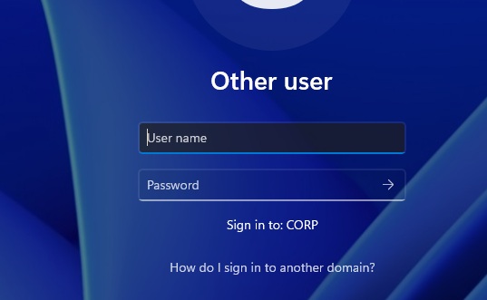

---

### 4. Group Policy — Security Baseline
Created a GPO named **Security-Baseline-Policy** and linked it to the corp.local domain. Configured the following security settings:

#### Password Policy
| Setting | Value | Justification |
|---|---|---|
| Minimum password length | 12 characters | Meets NIST SP 800-63B recommendations |
| Password complexity | Enabled | Requires mix of character types |
| Maximum password age | 91 days | Limits exposure window if credentials are compromised |
| Minimum password age | 90 days | Prevents immediate password cycling |
| Enforce password history | 12 passwords remembered | Prevents reuse of recent passwords |

#### Account Lockout Policy
| Setting | Value | Justification |
|---|---|---|
| Account lockout threshold | 5 invalid logon attempts | Mitigates brute-force attacks |
| Account lockout duration | 30 minutes | Balances security with help desk burden |
| Reset lockout counter after | 30 minutes | Resets failed attempt counter |

**Screenshot — Password Policy settings in Group Policy Editor:**

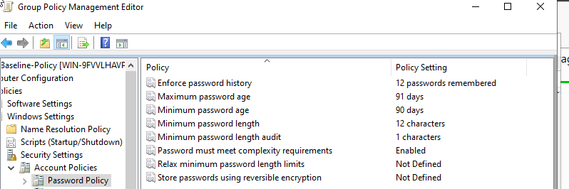

**Screenshot — Account Lockout Policy settings:**

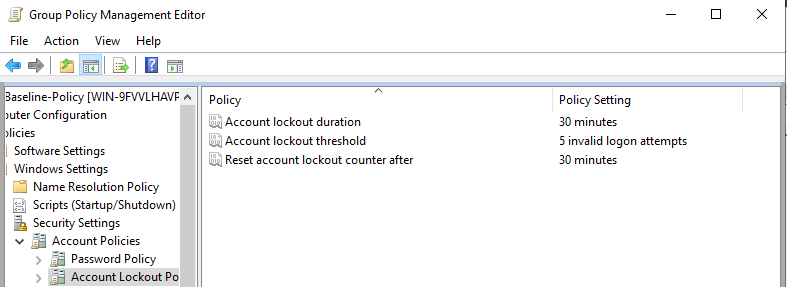

---

### 5. Policy Verification and Testing

#### GPO Applied to Client
Ran `gpupdate /force` on CLIENT01 logged in as CORP\john.smith to pull the policy from DC01 and confirm it applied successfully.

**Screenshot — gpupdate /force completing successfully on CLIENT01:**

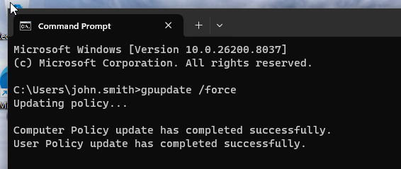

#### Account Lockout Test
Deliberately entered the wrong password 5+ times for CORP\bob.jones on the CLIENT01 login screen. Confirmed the account locked by opening ADUC on DC01, navigating to the HR OU, opening bob.jones Properties → Account tab, and verifying the "Unlock account" checkbox was checked. Unlocked the account after confirming the policy triggered correctly.

**Screenshot — bob.jones account locked in ADUC:**

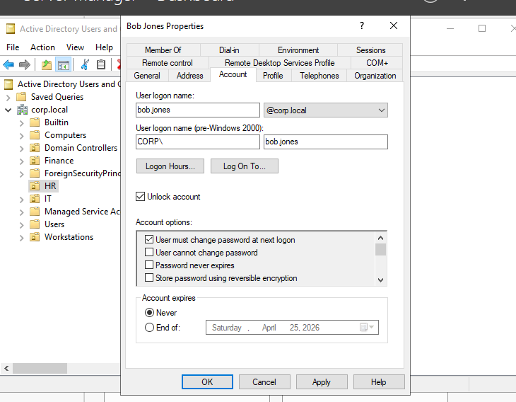

#### GPO Confirmed Applied via gpresult
Ran `gpresult /r /scope computer` on CLIENT01 as Administrator to confirm the Security-Baseline-Policy was listed under Applied Group Policy Objects.

**Screenshot — gpresult output showing Security-Baseline-Policy applied:**

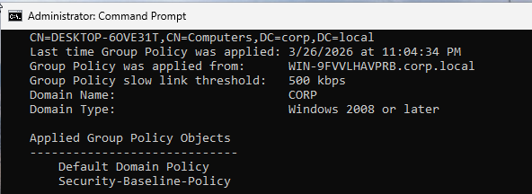

---

## Network Diagram

```
VMware NAT Network — 192.168.114.0/24
         |
         |--- DC01 (Windows Server 2022)
         |    IP: 192.168.114.10
         |    Roles: AD DS, DNS
         |    Domain: corp.local
         |
         |--- CLIENT01 (Windows 11 Enterprise)
              IP: 192.168.114.20
              DNS: 192.168.114.10
              Domain Member: corp.local
```

---

## GPO Settings Reference

Full list of configured Group Policy settings in Security-Baseline-Policy:

| Policy Path | Setting | Value |
|---|---|---|
| Password Policy | Minimum password length | 12 characters |
| Password Policy | Password must meet complexity requirements | Enabled |
| Password Policy | Maximum password age | 91 days |
| Password Policy | Minimum password age | 90 days |
| Password Policy | Enforce password history | 12 passwords remembered |
| Account Lockout | Account lockout threshold | 5 invalid logon attempts |
| Account Lockout | Account lockout duration | 30 minutes |
| Account Lockout | Reset account lockout counter after | 30 minutes |
| Security Options | Interactive logon: Machine inactivity limit | 900 seconds (15 min) |

---

## Lessons Learned

**VMware NAT subnet conflicts** — When multiple VMs are on the same host, VMware can assign them to different NAT subnets depending on how the VM was created. The fix is to either set a static IP on both VMs in the same subnet, or verify both are assigned to VMnet8 specifically. This caused significant troubleshooting time before discovering the subnet mismatch.

**DNS is the dependency for everything** — Domain join, Group Policy application, and AD replication all depend on DNS working correctly. CLIENT01 could not join the domain until DNS was confirmed working via `nslookup corp.local`. Running `nslookup` before attempting the domain join is the correct diagnostic order.

**gpresult scope matters** — Running `gpresult /r` as a domain admin without a logged-on user session returns no RSoP data. Adding `/scope computer` forces it to return computer-level policy data regardless of user context.

---

## Tools Used

- VMware Workstation Player 17
- Windows Server 2022 Standard Evaluation
- Windows 11 Enterprise Evaluation
- Active Directory Users and Computers (ADUC)
- Group Policy Management Console (GPMC)
- Group Policy Management Editor
- CMD / netsh / gpupdate / gpresult / nslookup / ipconfig

---

## Resume Bullet

> Built a Windows Server 2022 Active Directory lab environment in VMware; configured OUs, domain user accounts, and security groups simulating enterprise identity management; authored and enforced a domain-wide Group Policy security baseline including 12-character password complexity requirements, 5-attempt account lockout, and 15-minute inactivity timeout — validated via gpresult and live lockout testing on a domain-joined Windows 11 Enterprise client.
